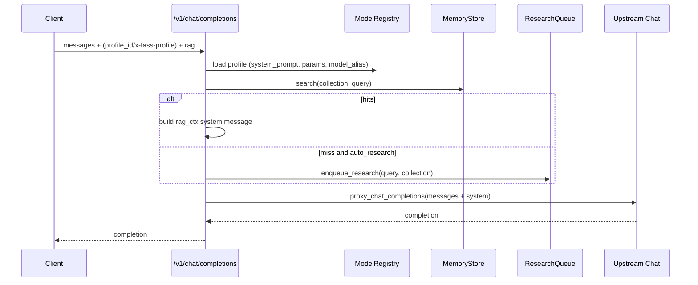
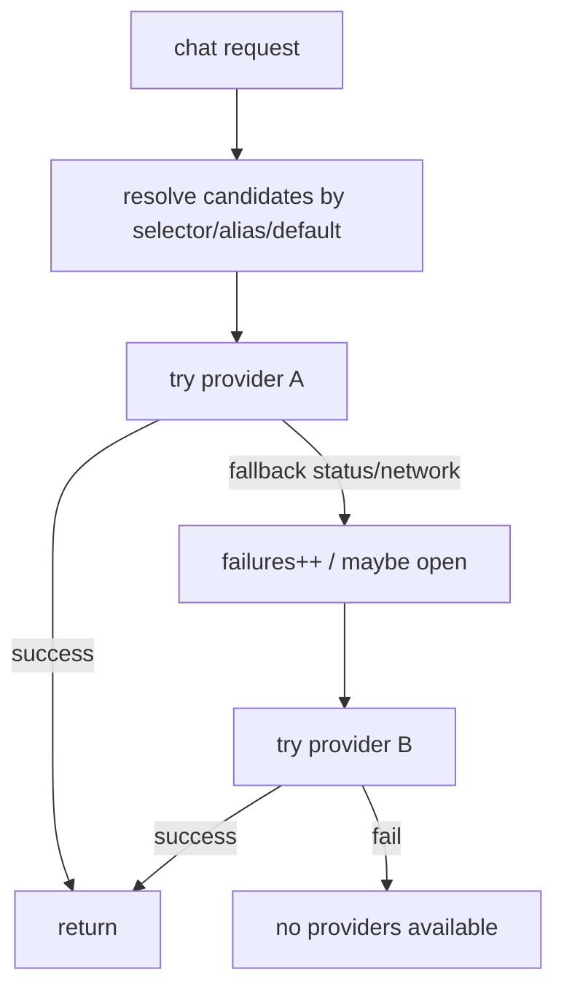
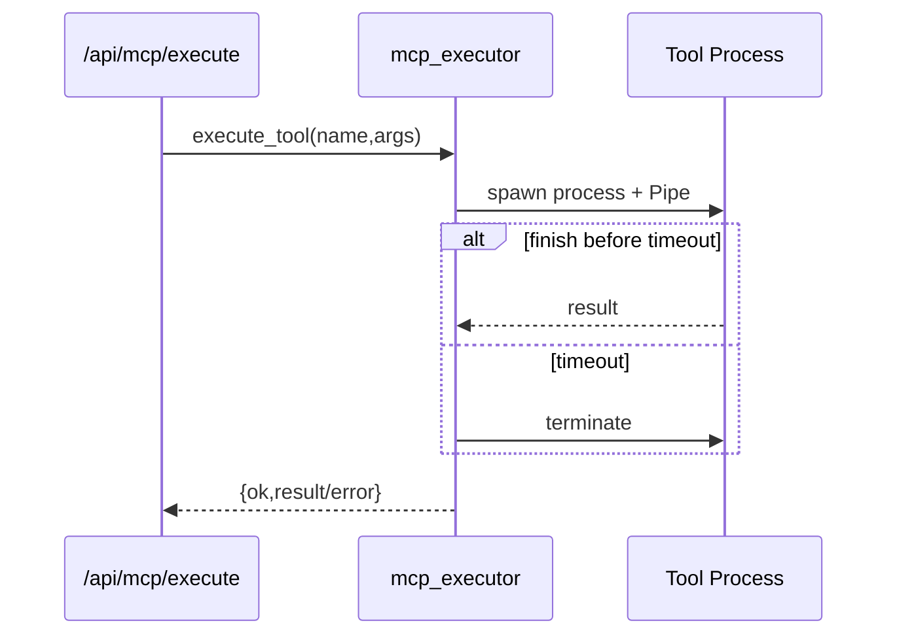

<div align="center">
  
  <h1>FASS Hub</h1>
  <p>一个以 Hybrid-RAG 为内核的 AI 知识中枢与多 Provider 网关（OpenAI 兼容 / 工具链 / 自动化闭环）。</p>
</div>

## 目录

- [1. 系统架构说明](#1-系统架构说明)
- [2. 核心功能模块](#2-核心功能模块)
- [3. 重要接口定义](#3-重要接口定义)
- [4. 关键业务流程图示](#4-关键业务流程图示)
- [5. 部署与运行要求](#5-部署与运行要求)
- [6. 已知问题与改进建议](#6-已知问题与改进建议)
- [7. 相关文档](#7-相关文档)

## 1. 系统架构说明

### 1.1 总览

FASS 的核心思路是：以 FastAPI 作为统一网关，对外暴露 OpenAI 兼容接口与控制面 API；在内部提供“可重建”的 Hybrid-RAG 存储与检索（SQLite-as-Truth + BM25 + ANN），并用后台任务驱动索引同步、Research/Dreaming 自动化闭环与 Provider 健康检查。

### 1.2 组件与边界

```mermaid
flowchart LR
  Client[Client / SDK] -->|HTTP| Gateway[FastAPI Gateway]

  subgraph GatewayModules[fass_gateway]
    OpenAICompat[/v1/* OpenAI Compat/]
    APIs[/api/* Control Plane/]
    TaskRunner[TaskRunner Background Loop]
    Trace[Trace SSE + DB]
    Audit[Audit Log]
    OpenAICompat --> LLMProxy[LLM Proxy]
    APIs --> Registries[Provider/Model Registry]
    APIs --> Tools[MCP + Plugins]
    APIs --> MemoryAPI[Memory API]
    TaskRunner --> Health[Provider Health Monitor]
    TaskRunner --> IndexSync[Memory Index Sync]
    TaskRunner --> ResearchDream[Research + Dreaming]
  end

  Gateway --> OpenAICompat
  Gateway --> APIs

  LLMProxy --> NewAPI[(OpenAI-compatible Upstream)]
  Registries --> ProviderRouter[Multi-Provider Router]
  ProviderRouter --> Providers[(Providers: /v1 or /api/chat)]

  MemoryAPI --> MemoryStore[MemoryStore]
  MemoryStore -->|优先| MemosCore[memoscore (Rust/PyO3)]
  MemoryStore -->|降级| Fallback[(SQLite fallback)]
  MemoryStore --> FSStore[(FS Store: 可重建文本)]

  subgraph MemosCoreInternals[memoscore]
    DB[(SQLite: documents/index_tasks)]
    Tantivy[(Tantivy BM25)]
    USearch[(USearch ANN)]
    DB <--> Tantivy
    DB <--> USearch
  end
```

### 1.3 数据与索引（SQLite-as-Truth）

Hybrid-RAG 的核心数据与索引分为三部分：

- 真值库（SQLite）：存储文档 `documents` 与索引任务队列 `index_tasks`。写入只保证 SQLite 更新成功；索引构建通过后台任务异步完成。
- 全文索引（Tantivy）：用于 BM25 检索（content/path 字段）。
- 向量索引（USearch）：用于 ANN 检索（L2sq 距离，使用 `1/(1+dist)` 转相似度）。

这种设计的关键收益是：即使全文/向量索引损坏或丢失，也可以从 SQLite（及可选 FS store）重新构建索引，保证可恢复性。

## 2. 核心功能模块

### 2.1 Gateway（FastAPI）

入口位于 `fass_gateway/app/main.py`，负责：

- 注册路由：`/v1/*`、`/api/*`（memory/control/mcp/plugins/settings/tasks/trace 等）。
- 启动时自愈：备份 → 完整性检查 → 必要时回滚。
- 加载 Provider/Model 配置与内置 MCP 工具。
- 启动后台 `TaskRunner`（健康检查、索引同步、research/dreaming、定时任务等）。

### 2.2 Hybrid-RAG 内核（memoscore）

`memoscore` 是一个 Rust + PyO3 的 Python 扩展模块，对外暴露类 `MemosCore`：

- `upsert_documents(collection, docs)`：写入/更新 `documents`，并将该 doc 标记为需要重建索引（写入/更新 `index_tasks`）。
- `sync_index_tasks(limit=200)`：消费索引任务队列：更新 Tantivy 文档、更新 USearch 向量，并落盘。
- `search(collection=None, query_text=None, query_vec=None, top_k=8)`：执行 BM25 与 ANN 并做融合排序。

融合规则（核心业务规则）：

- BM25：按本批最大分数归一化。
- ANN：距离转相似度 `1/(1+dist)` 后按本批最大相似度归一化。
- 融合：`score = text_norm*0.55 + vec_norm*0.45`，并标注 `source=hybrid/bm25/ann`。

### 2.3 MemoryStore（memoscore 封装与降级）

`fass_gateway/app/services/memory.py` 的 `MemoryStore` 统一封装写入与检索：

- 优先使用 `memoscore.MemosCore(store_dir, 768, 200_000)`。
- 当 memoscore 未安装/不可用时，自动降级到 `_FallbackCore`（SQLite + LIKE / 余弦相似度的简化检索）。
- 可选把原始文本写入 `fs_store_dir`，用于重建与审计留痕。

### 2.4 Provider/Model 管理与路由

主要概念：

- Provider：上游服务实例（base_url、鉴权、超时、额外 header、enabled 等）。
- ModelAlias：对外“模型别名”与优先级列表（`provider_id + upstream_model`）。
- Profile：对话档案（默认模型别名、系统提示词、默认参数等）。

多 Provider 路由器（`provider_router.py`）提供：

- 显式选择 `provider_id::model`。
- ModelAlias priority 顺序回退。
- 熔断：连续失败 >=3 次进入 open，30s 后 half_open 试探。
- 兼容 Ollama：`/v1/chat/completions` 404 时回退 `/api/chat`。

### 2.5 MCP 工具（隔离执行）

MCP 工具以“注册表 + 子进程隔离执行”方式运行：

- 注册：`@mcp_tool(...)` 装饰器写入注册表。
- 执行：`multiprocessing.Process + Pipe` 子进程执行，支持超时终止与输出截断。
- 控制：可在控制面启用/禁用工具；危险工具默认禁止执行。

### 2.6 外部插件（stdio）

插件目录 `plugins/**/plugin.json`（以及 legacy 目录）定义工具元数据与入口命令，运行时通过子进程 stdio 交换 JSON。可配置 postprocess 将结果回灌 memory。

### 2.7 自动化闭环（Research → Dreaming）

- Research：在 RAG 未命中且允许 `auto_research` 时入队，后台使用 MCP 的 web 工具抓取内容并写入 memory。
- Dreaming：对近期 research 结果进行 LLM 总结，并将总结写回 memory，形成闭环。

### 2.8 Trace 与 Audit

- Trace：事件先落库（真值），再通过 TraceHub 广播 SSE；用于可回放与调试。
- Audit：关键控制面动作写入加密日志（Fernet），避免明文泄露敏感操作细节。

## 3. 重要接口定义

### 3.1 认证（通用）

若配置了 `api_key`，大多数接口要求：

- Header：`Authorization: Bearer <api_key>`

### 3.2 OpenAI 兼容接口

| 接口 | 方法 | 说明 | 关键入参 | 关键返回 |
|---|---:|---|---|---|
| `/v1/models` | GET | 模型列表（当前走 newapi 上游） | - | OpenAI list models |
| `/v1/chat/completions` | POST | Chat（支持 profile 注入与 RAG 注入） | `messages[]`、可选 `profile_id`、可选 `rag{collection,top_k,auto_research}` | OpenAI chat completion |
| `/v1/embeddings` | POST | Embeddings（当前走 newapi 上游） | `model`、`input` | OpenAI embeddings |

`/v1/chat/completions` 的扩展字段（本项目定义）：

- `profile_id`：或请求头 `x-fass-profile`，用于注入系统提示词与默认参数。
- `rag`：`{"collection": "...", "top_k": 5, "auto_research": false}`。

### 3.3 Memory API

| 接口 | 方法 | 说明 |
|---|---:|---|
| `/api/memory/upsert` | POST | 写入/更新记忆（可选写 fs_store + embeddings） |
| `/api/memory/search` | POST | 检索记忆（默认 `use_vector=true` 先做 query embedding） |
| `/api/memory/ingest` | POST | 摄取 diary/workspace 到 memory |
| `/api/memory/rebuild` | POST | 从 fs_store 扫描回灌重建（再触发索引任务） |

`/api/memory/upsert` 请求示例：

```json
{
  "collection": "shared",
  "items": [
    {"path": "note://demo/1", "content": "FASS 是一个网关"}
  ]
}
```

### 3.4 Control Plane（Provider/Model/Profile/自愈）

前缀：`/api/control`

- Providers：`GET /providers`、`POST /providers`、`DELETE /providers/{provider_id}`、`POST /providers/{provider_id}/test`、`GET /providers/{provider_id}/models`。
- Defaults：`POST /defaults`（设置默认 Provider，并触发 model catalog sync）。
- Model catalog：`GET /model_catalog`、`POST /model_catalog/sync`。
- ModelAlias：`GET/POST/DELETE /models...`
- Profile：`GET/POST/DELETE /profiles...`，以及 `POST /profiles/default`。
- Websearch：`GET/POST /websearch`（配置 searxng base url）。
- Self-heal：`POST /self_heal/daily_tick`、`POST /self_heal/rollback_latest`、`POST /self_heal/run_full_check`。

### 3.5 MCP 与 Plugins

- MCP：`GET /api/mcp/tools`、`POST /api/mcp/tools/{tool_name}/enable`、`POST /api/mcp/execute`、`GET /api/mcp/models`。
- Plugins：`GET /api/plugins/tools`、`POST /api/plugins/invoke`。

### 3.6 Settings / Tasks / Models

- Settings：`GET/POST /api/settings`（写入 SQLite settings，并热更新进程内 settings）。
- Tasks：`GET/POST/POST/DELETE /api/tasks...`（任务记录在 SQLite）。
- Models list：`GET /api/models/list`（拉取 newapi/ollama 可用模型列表）。

### 3.7 Trace

- `POST /api/trace/conversations`：创建会话
- `GET /api/trace/conversations/{conversation_id}/events`：SSE 事件流
- `POST /api/trace/conversations/{conversation_id}/send`：触发一次会话运行并写事件

## 4. 关键业务流程图示

### 4.1 Memory 写入 → 索引任务 → 后台同步

```mermaid
sequenceDiagram
  participant C as Client
  participant API as /api/memory/upsert
  participant MS as MemoryStore
  participant EMB as embed_texts
  participant MC as memoscore.MemosCore
  participant DB as SQLite(documents/index_tasks)
  participant TR as TaskRunner
  participant TI as Tantivy
  participant VI as USearch

  C->>API: upsert(collection, items)
  API->>MS: upsert_texts
  MS->>EMB: embeddings(contents) (best effort)
  MS->>MC: upsert_documents(docs)
  MC->>DB: upsert documents; mark indexed_at=NULL
  MC->>DB: upsert index_tasks(status=pending)
  TR-->>MC: sync_index_tasks(limit=200) (periodic)
  MC->>TI: delete+add doc; commit
  MC->>VI: remove+add vector; save
  MC->>DB: mark index_tasks done; set indexed_at
```

### 4.2 Hybrid 检索（BM25 + ANN 融合）

```mermaid
flowchart TD
  Q[query_text / query_vec] --> BM25[BM25(Tantivy)]
  Q --> ANN[ANN(USearch)]
  BM25 --> N1[Normalize by max BM25]
  ANN --> N2[dist -> sim=1/(1+dist) -> normalize]
  N1 --> Merge[Merge by doc_id]
  N2 --> Merge
  Merge --> Score[score = t*0.55 + v*0.45]
  Score --> TopK[sort desc, take top_k]
  TopK --> Fetch[fetch content from SQLite]
```

### 4.3 `/v1/chat/completions`（Profile + RAG + auto_research）



### 4.4 Research → Dreaming 回灌闭环

```mermaid
flowchart LR
  Miss[RAG Miss] --> Enqueue[enqueue_research]
  Enqueue --> Queue[(research_jobs)]
  Queue --> Tick[tick_research_jobs]
  Tick --> Web[web.search/web.fetch (MCP)]
  Web --> Upsert[upsert into memory]
  Upsert --> History[(research_history)]
  History --> Dream[run_dreaming]
  Dream --> Summary[LLM summarize]
  Summary --> Upsert2[upsert summary into memory]
```

### 4.5 Provider Router（候选/回退/熔断）



### 4.6 MCP 工具隔离执行（子进程 + 超时）



## 5. 部署与运行要求

### 5.1 运行时依赖

- Python: >= 3.10
- 后端依赖：见 `fass_gateway/requirements.txt`
- 可选（高性能 Hybrid-RAG）：Rust toolchain + maturin（用于构建 `memoscore` 扩展）

### 5.2 安装

后端：

```bash
pip install -r fass_gateway/requirements.txt
```

可选安装 memoscore（启用 Tantivy + USearch）：

```bash
pip install -e memoscore
```

若不安装 memoscore，系统会自动退化为 SQLite fallback 检索（功能可用但性能与检索质量较弱）。

### 5.3 配置

- 复制并编辑：`fass_gateway/config.env.example` → `config.env`

关键配置项：

- `api_key`：开启鉴权（可选）
- `fs_store_enabled` / `fs_store_dir`：是否启用文本 FS store（用于重建/留痕）
- `embedding_provider`：`local` 或 `openai_compat`
  - `local`：使用 `sentence-transformers` 加载 `embedding_model_path`
  - `openai_compat`：通过 `llm_base_url` 调用 `/v1/embeddings`（或回退 `/api/embeddings`）
- 上游（两套配置路径同时存在）：
  - newapi 直连（当前 `/v1/*` 默认使用）：`newapi_base_url` + `newapi_api_key`
  - provider registry（多 Provider/熔断回退）：通过 `/api/control/providers` 配置

### 5.4 启动

```bash
python -m uvicorn fass_gateway.app.main:app --host 0.0.0.0 --port 8000
```

### 5.5 数据目录说明

- `fass_gateway/data/`：运行态 SQLite、memoscore 索引与缓存（不应上传到 Git 仓库）
- `fs_store_dir`：可重建的原文片段存储（通常同样不入库）

## 6. 已知问题与改进建议

### 6.1 一致性与架构

- `/v1/chat/completions` 当前使用 `llm_proxy`（newapi 直连），未复用 `provider_router` 的多 Provider 与熔断/回退能力；建议统一收敛到一条“上游选择”路径。

### 6.2 检索质量与可用性

- embedding 维度在 `MemoryStore` 中固定为 768，若实际 embedding 模型输出维度不同会触发 memoscore dim mismatch；建议将 embedding_dim 配置化并在启动时自检。
- memoscore 的 collection 过滤在融合排序后执行，可能导致返回不足 `top_k`；建议把 collection 作为搜索阶段条件或在不足时继续补齐候选。

### 6.3 可观测性

- 多处 `except: pass` 使故障静默；建议在不泄露敏感信息前提下记录结构化日志，并在 API 返回中提供可追踪 request_id。

### 6.4 安全与合规

- 建议明确区分 `api_key`（访问鉴权）与 `audit_log_key`（数据加密），并强调不要提交 `config.env`。

## 7. 相关文档

- 开发文档索引：[docs/INDEX.md](./docs/INDEX.md)
- API 参考：[docs/API_REFERENCE.md](./docs/API_REFERENCE.md)
- 结构树与后端逐文件索引：[docs/STRUCTURE_TREE.md](./docs/STRUCTURE_TREE.md)、[docs/BACKEND_FILE_INDEX.md](./docs/BACKEND_FILE_INDEX.md)
- 实体机部署：[docs/DEPLOYMENT_BAREMETAL.md](./docs/DEPLOYMENT_BAREMETAL.md)
- 技术白皮书：[docs/TECHNICAL_WHITEPAPER.md](./docs/TECHNICAL_WHITEPAPER.md)

## 许可证

本项目使用 MIT License，详见 [LICENSE](./LICENSE)。
